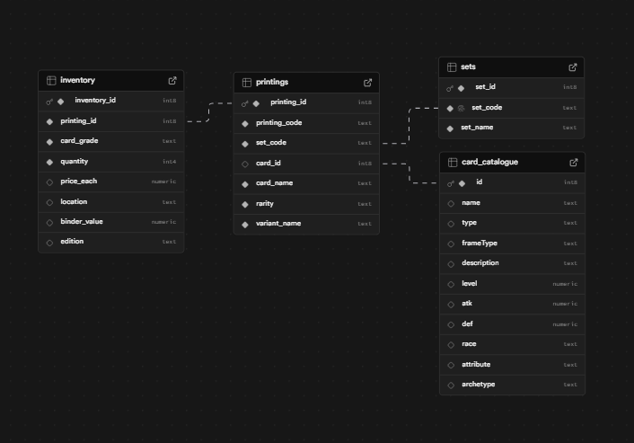

# Yu-Gi-Oh Card Collection Database

A PostgreSQL database for managing a Yu-Gi-Oh card collection, including card catalog data, printings across multiple sets, and a personal inventory system.

This project began as a complex Google Sheets workbook that behaved like a relational database. It has been redesigned and implemented as a proper PostgreSQL schema to support scalable querying, data validation, and future web applications.

---

## Features

• Full **Yu-Gi-Oh card catalogue** imported from YGOProDeck data  
• Tracks **printings across hundreds of sets**  
• Supports **rarity variants and artwork variants**  
• Inventory system with **automatic quantity aggregation**  
• Clean relational schema designed for future applications  
• SQL functions for **safe inventory insertion**

---

## Database Structure

The schema separates **card identity**, **printing identity**, and **personal ownership**.

### Core Tables

| Table | Purpose |
|-----|-----|
| `card_catalogue` | Master list of all Yu-Gi-Oh cards |
| `sets` | All Yu-Gi-Oh TCG sets |
| `printings` | Specific card printings (set + rarity + variant) |
| `inventory` | Personal card collection |

---

## Entity Relationship Diagram



---

## Key Design Decisions

### Card Identity vs Printing Identity

The same card can appear in multiple sets and rarities.

Example:

`Blue-Eyes White Dragon`

appears in many printings such as:

`LOB-001 (Ultra Rare)`

`SDK-001 (Ultra Rare)`

`LDK2-ENK01 (Common, multiple artworks)`

Therefore:

`card_catalogue`

↓

`printings`

↓

`inventory`


---

### Inventory Aggregation

If the same card is added multiple times with identical attributes:

`printing_id, grade, edition, rarity`


the quantity is automatically incremented instead of creating duplicate rows.

Example:

+1 JUSH-EN040 1st Edition, Starlight Rare
+1 JUSH-EN040 1st Edition, Starlight Rare

becomes:

quantity = 2

+1 JUSH-EN040 1st Edition, Starlight Rare
+1 JUSH-EN040 1st Edition, Super Rare

becomes:

seperate entries


This behavior is implemented using a PostgreSQL **UPSERT function**.

---

## SQL Function Example

```sql
SELECT * FROM upsert_inventory_item(
  'JUSH-EN040',
  'Starlight Rare',
  '1st Edition',
  'Near Mint', -- Grade is optional, if no grade is specified, defaults to Ungraded
  'Binder 1', -- Location is optional, if no location is specified, defaults to NULL
  1,
  4.50
);
```
## Technologies Used

`PostgreSQL`

`Supabase`

`SQL`

`GitHub`

## Future Development

Planned features include:

• Web interface for searching the collection

• Add cards directly from card database search

• Automatic price updates from card marketplaces

• Deck building support

• Collection value tracking

## Motivation

This project started as a personal spreadsheet to track my card collection. As the dataset grew to thousands of entries across hundreds of sets, it became clear that a relational database would provide much better scalability and data integrity.

This repository represents the redesigned system and serves as a foundation for future applications.

## Author

Brian Ceradsky
